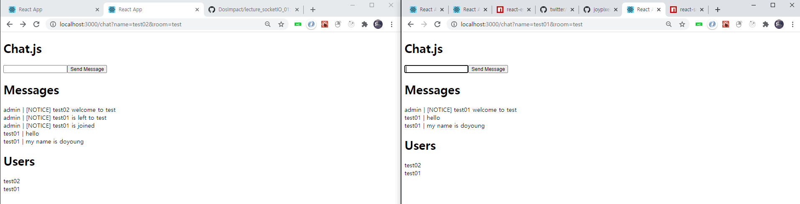

# hello socket.io



### server/side

- users state 관리

- [ ] addUser
- [ ] getUser
- [ ] removeUser
- [ ] getUsersInRoom

### socket logic

- ServerSide:emit
- message : client로 메시지를 보낸다. ✔
- roomData : 방의 인원 정보를 보낸다. ✔

- ClientSide:emit
- connection ✔
- disconnect ✔
- join ✔
- sendMessage ✔

- [ ] connection, disconnect
- [ ] join : user등록,기본 메시지, 브로드 케스트 알림, room정보 제공
- [ ] sendMessage & Message : 메시지 전파, cb
- [ ] roomData : 방정보 전파 when join,disconnect

# FB

- react-router-dom : Link : onClick 이번트 > to 에 걸리 경로로 가는데, e.prevenDefault로 막을 수 있다.

# FB

- 양방향 통신이라 머리 아프네...
- emit을 할것만 정하자.

# snippet

```
socket.join
socket.emit("",{},()=>{}) call bakc
socket.on("",({},()) =>{}))

io.to().emit
```

- socket.emit 1:1 메시징
- socket.broadcast.emit 나빼고 전부 메시징
- io.to().emit 나 포함 전부 메시징

# BUG

- 뒤로가기하면, useEffect cleanup 안됨, 다시 또 들어가면 충돌
